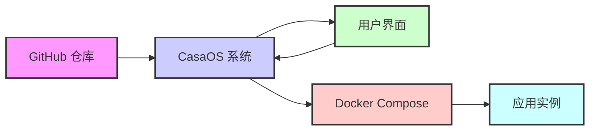

# 项目概述

## 项目背景

CasaOS AppStore 是一个应用商店，旨在帮助用户轻松地在其 CasaOS 设备上安装和管理各种应用程序。该项目通过提供一个集中化的平台，简化了用户查找、安装和更新应用程序的过程。

## 项目目标

该项目的核心目标是扩展 CasaOS 生态系统，通过社区贡献的应用商店，为用户提供丰富的应用选择。目标是创建一个易于使用、功能强大且可扩展的应用商店，使用户能够轻松地在其 CasaOS 设备上发现和安装所需的应用程序。

## 项目价值

CasaOS AppStore 为 CasaOS 用户带来了以下价值：

*   **丰富的应用生态**：用户可以访问大量的第三方应用程序，极大地扩展了 CasaOS 的功能。
*   **简化的应用管理**：用户可以通过统一的界面安装、更新和管理应用程序，无需手动操作 Docker Compose。
*   **社区驱动**：依靠社区贡献，应用商店能够快速增长并保持多样性。

# 功能模块详解

## 功能描述

CasaOS AppStore 的核心功能是提供一个平台，用户可以在其中浏览、搜索和安装应用程序。应用程序以 Docker Compose 格式提供，简化了部署过程。

## 输入输出

*   **输入**：
    *   用户请求（浏览、搜索、安装应用）
    *   应用商店配置文件（`category-list.json`, `recommend-list.json`, `featured-apps.json`）
    *   应用描述文件 (`docker-compose.yml`, `icon.png`, `screenshot-*.png`, `thumbnail.png`)
*   **输出**：
    *   应用列表
    *   应用详情
    *   应用安装状态

## 模块依赖

CasaOS AppStore 依赖于以下模块：

*   CasaOS 系统：提供应用运行的基础环境。
*   Docker 和 Docker Compose：用于容器化应用的部署和管理。
*   GitHub：用于代码托管和版本控制。

# 技术架构设计

## 架构图

CasaOS AppStore 的架构可以简化描述为：

1.  **GitHub 仓库**: 存储应用商店的配置文件 (`category-list.json`, `recommend-list.json`, `featured-apps.json`) 和应用描述文件 (`Apps/*/docker-compose.yml`, `Apps/*/icon.png`, 等)。
2.  **CasaOS 系统**: 从 GitHub 仓库拉取应用商店数据。
3.  **用户界面**: CasaOS 提供用户界面，展示应用列表和详情。用户可以通过 UI 浏览和搜索应用。
4.  **Docker 和 Docker Compose**: 用户选择安装应用后，CasaOS 系统解析应用的 `docker-compose.yml` 文件，使用 Docker Compose 在 CasaOS 系统上部署应用。

数据流：

1.  CasaOS 系统启动时或定期从 GitHub 仓库拉取最新的应用商店数据。
2.  用户通过 CasaOS UI 浏览应用商店。UI 从 CasaOS 系统获取应用列表和详情数据。
3.  用户选择安装应用。
4.  CasaOS 系统读取对应应用的 `docker-compose.yml` 文件。
5.  CasaOS 系统使用 Docker Compose 部署应用。

## 技术选型

*   Docker Compose：用于应用定义和部署。使用 YAML 格式定义多容器应用，简化部署流程。
*   JSON：配置文件格式，用于存储应用商店的元数据，例如分类、推荐列表、特色应用列表等。易于解析和生成。
*   Markdown：文档编写格式，用于编写项目文档和应用描述（虽然目前应用描述直接写在 `docker-compose.yml` 中，但未来可能考虑使用独立的 Markdown 文件）。
*   GitHub：代码托管平台，用于存储和版本控制应用商店数据。利用 GitHub 的版本控制和协作功能。

## 部署方案

CasaOS AppStore 的部署方案是基于 GitHub 的内容分发模式。应用商店本身没有独立的后端服务。CasaOS 系统直接从 GitHub 仓库获取数据。

1.  **数据存储**: 应用商店的所有数据都存储在 GitHub 仓库中。
2.  **内容分发**: CasaOS 系统作为客户端，定期或在启动时从 GitHub 仓库拉取数据。
3.  **应用部署**: CasaOS 系统内置 Docker 和 Docker Compose，直接在本地部署应用。

# 数据流程分析

## 数据流图

（已在技术架构设计中包含）

## 数据字典

*   `category-list.json`：应用分类列表配置文件。
*   `recommend-list.json`：推荐应用列表配置文件。
*   `featured-apps.json`：特色应用列表配置文件。
*   `docker-compose.yml`：Docker Compose 应用描述文件，包含应用配置信息和 CasaOS 元数据。
*   `icon.png`：应用图标。
*   `screenshot-*.png`：应用截图。
*   `thumbnail.png`：应用缩略图。

## 数据存储

应用商店数据主要存储在 GitHub 仓库中。每个应用的配置和元数据都包含在 `Apps/*/docker-compose.yml` 文件中。应用商店的全局配置信息存储在 `category-list.json`, `recommend-list.json`, `featured-apps.json` 等文件中。

# 关键技术点与难点解析

## 关键技术点

*   Docker Compose 应用封装和部署。
*   应用商店数据管理和更新。
*   CasaOS 系统集成。

## 难点解析

*   如何保证应用商店的应用质量和安全性。
*   如何维护应用商店的更新和维护。
*   如何吸引更多的开发者贡献应用。

# 潜在风险评估与应对策略

## 潜在风险

*   应用质量参差不齐。
*   安全风险（恶意应用）。
*   维护成本高。

## 应对策略

*   建立应用审核机制，确保应用质量。
*   加强安全审查，防范恶意应用。
*   社区参与维护，降低维护成本。

# 项目改进建议与未来发展方向

## 项目改进建议

*   完善应用审核机制。
*   增加用户评价和反馈功能。
*   优化应用商店搜索和浏览体验。

## 未来发展方向

*   支持更多应用类型（例如，非 Docker 应用）。
*   提供应用商店 API，方便第三方集成。
*   扩展应用商店功能，例如，应用内购买、应用订阅等。