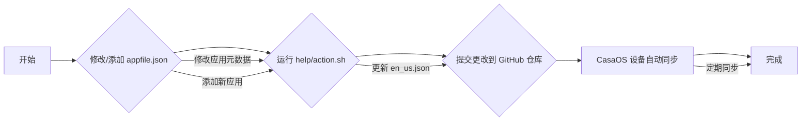

# CasaOS AppStore 内容更新和同步计划

## 目标

理解如何更新 CasaOS AppStore 项目的内容，并将更新同步到下端设备（CasaOS 系统）。

## 系统架构

CasaOS AppStore 采用客户端-内容分发网络 (Client-CDN) 模式。应用商店数据存储在 GitHub 仓库中，CasaOS 系统作为客户端从 GitHub 仓库拉取数据。

## 技术栈

- Docker Compose
- JSON
- Markdown
- GitHub

## 更新流程

## 计划步骤

1. **修改/添加 `appfile.json`：**
    - 如果是 **更新现有应用**，需要修改 `Apps/<AppName>/appfile.json` 文件，更新应用的元数据信息。
    - 如果是 **添加新应用**，需要在 `Apps/` 目录下创建一个新的应用目录 `Apps/<NewAppName>/`，并在该目录下创建 `appfile.json` 文件，填写新应用的元数据信息。
    - **注意：**  需要遵循 `CONTRIBUTING.md` 中定义的 CasaOS AppStore 规范。
2. **运行 `help/action.sh` 脚本：**
    - 执行 `help/action.sh` 脚本，**自动提取 `appfile.json` 中的信息，更新 `./CasaOS-i18n/back-end/en_us.json` 文件**。
    - 确保系统中已安装 `jq` 工具。
3. **提交更改到 GitHub 仓库：**
    - 使用 Git 命令将修改后的 `appfile.json` 文件和更新后的 `en_us.json` 文件 **提交到 GitHub 仓库**。
    - 建议 **创建 Pull Request (PR)**  进行代码审查。
4. **等待 CasaOS 设备自动同步：**
    - CasaOS 设备会 **定期自动从 GitHub 仓库同步应用商店数据**。
    - 更新后的应用信息将 **自动同步到 CasaOS 设备**。
    - **同步频率未知，可能需要等待一段时间才能在设备上看到更新**。